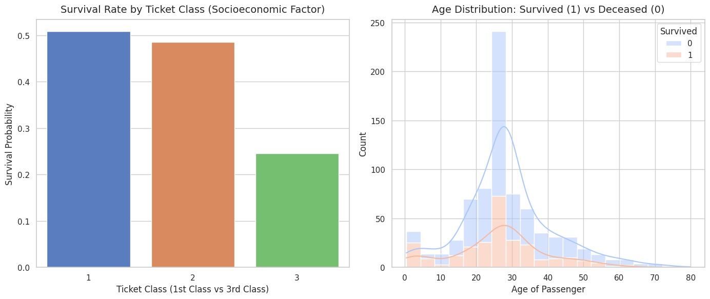

# Titanic Data Cleaning & Visualization Project

## 🔍 1. Data Preprocessing (Cleaning)
In this phase, raw passenger data was refined for analysis through the following steps:
* **Handling Missing Data:** Filled missing values in the `Age` column using the median age of passengers to avoid losing rows. 
* **Feature Removal:** Dropped the `Cabin` column entirely because over 70% of its records were missing.
* **Outlier Mitigation:** Cleaned extreme fare values using the Interquartile Range (IQR) method to avoid skewed visualizations.

## 📊 2. Visual Dashboard
Here is the final visual layout showing the insights extracted from the cleaned data:

## 🗣️ 3. Storytelling with Data (Key Insights)
* **The Wealth Gap:** There is a massive drop in survival probability moving from 1st-class passengers down to 3rd class. Socioeconomic status was a critical driver in survival priority.
* **The "Women and Children First" Protocol:** Looking at the age distribution stack, children (ages 0-10) had higher survival ratios relative to their group size, showing clear evidence of rescue operational priorities during the disaster.
